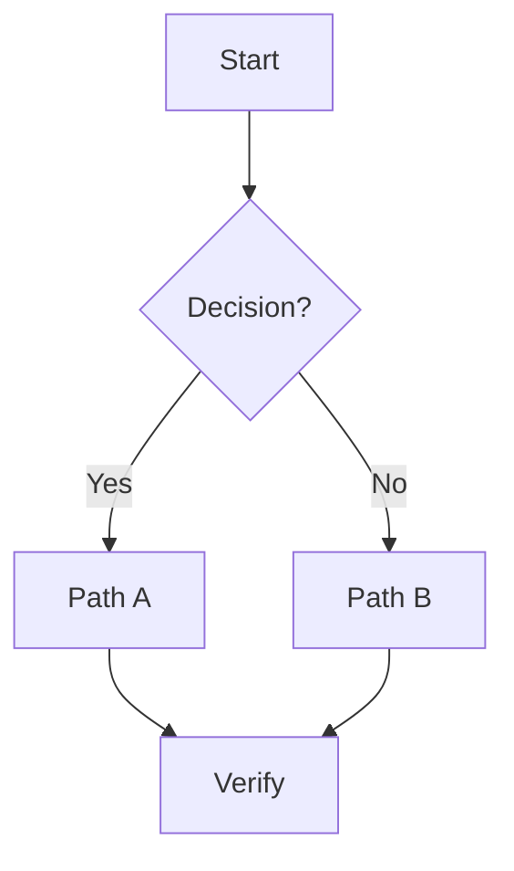
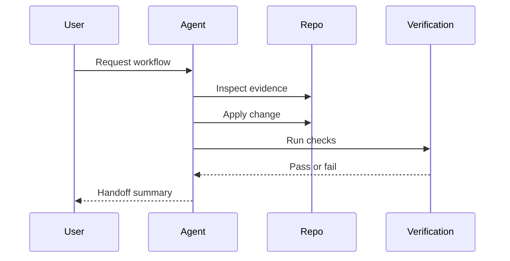
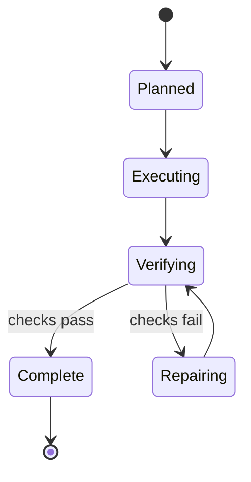
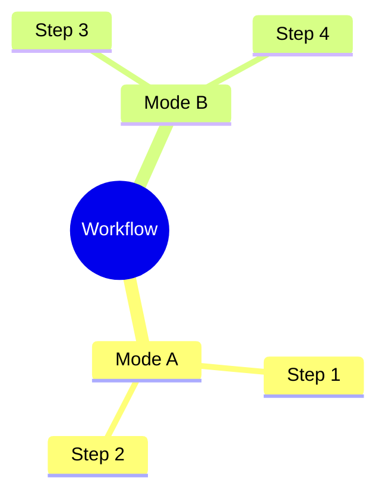

# Mermaid Patterns

Use these compact patterns for developer workflow documentation.

## Decision Flowchart

Best for: routing tables, mode selection, and “which tool do I use?” docs.

## Sequence Diagram

Best for: agent/tool/repo interactions, implementation loops, and verification paths.

## State Diagram

Best for: lifecycle, retry, stop/continue, and status semantics.

## Mind Map

Best for: inventories and conceptual maps. Do not use mind maps for strict ordering.
