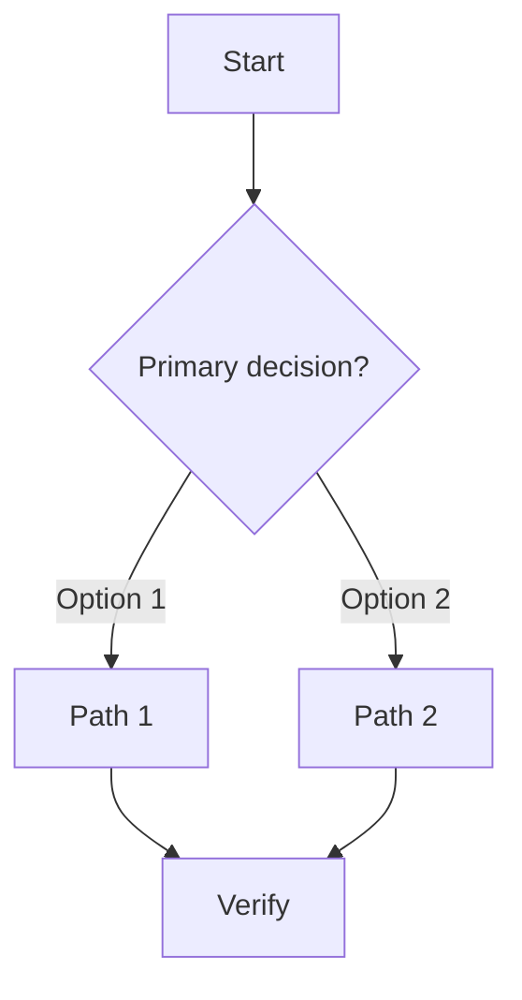
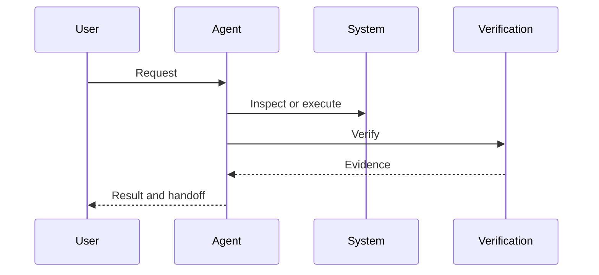
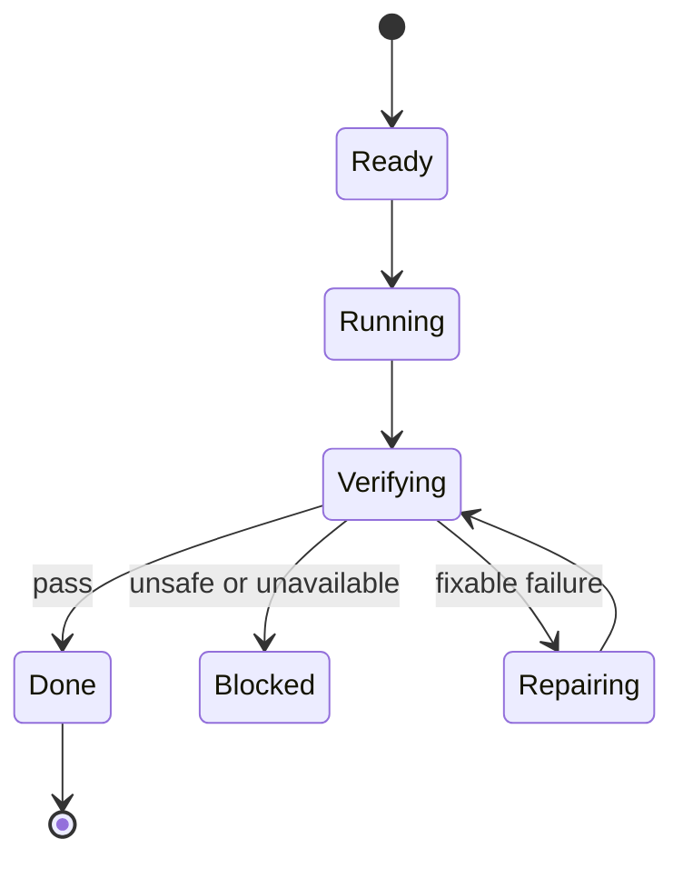

# [Workflow Name] Diagrams

## Purpose

State what workflow these diagrams clarify and who should use them.

## Source Basis

- Source notes/docs reviewed:
- Assumptions:
- Unknowns:

## Routing Decision Tree

Use this when the reader needs to choose a path.

## Interaction Sequence

Use this when multiple actors or tools pass control.

## Lifecycle / State Model

Use this when status changes or stop rules matter.

## Diagram Notes

| Diagram | What It Shows | How to Use It |
|---|---|---|
| Routing Decision Tree | Path selection | Start here for mode choice |
| Interaction Sequence | Actor/tool order | Use for implementation flow |
| Lifecycle / State Model | Status transitions | Use for stop/continue rules |

## Maintenance Rules

- Update diagrams when workflow order, actors, stop rules, or verification gates change.
- Keep node labels short and action-oriented.
- Split diagrams before they become dense.
- Keep assumptions outside the diagram unless they are part of the public workflow.
