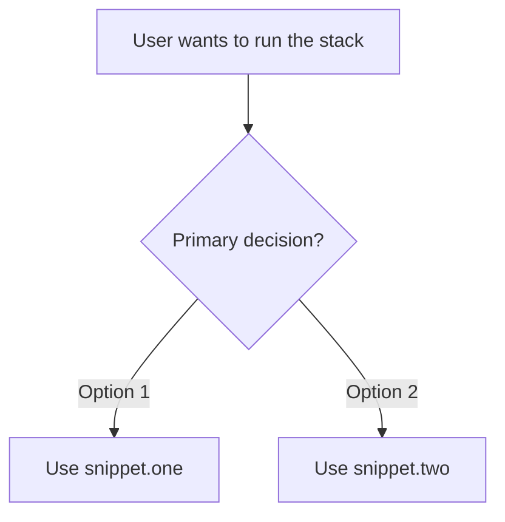

# [Snippet Stack Name] User Guide

## Purpose

[Explain what this snippet stack helps users do.]

## Start Here

| Situation | Use | Why |
|---|---|---|
| [User situation] | `[snippet.name]` | [Reason] |

## Decision Tree



## Snippet Inventory

| Snippet | Purpose | Use When |
|---|---|---|
| `[snippet.name]` | [Short purpose] | [Trigger condition] |

## Canonical Flows

### Flow 1 - [Mode Name]

```text
snippet.start
→ snippet.next
→ verify
→ handoff
```

Use when:

- [condition]
- [condition]

### Flow 2 - [Mode Name]

```text
snippet.start
→ snippet.branch
→ snippet.closeout
```

Use when:

- [condition]
- [condition]

## Invocation Examples

```text
[snippet.name]

Task: [task]
Context: [context]
Constraints: [constraints]
Success criteria: [criteria]
```

## Stop and Continue Rules

### Stop For

- [blocking condition]

### Continue For

- [normal continuation condition]

## Compatibility Notes

| Legacy or Alias | Current Recommendation |
|---|---|
| `[old.name]` | Use `[new.name]` unless compatibility is required |

## Maintenance Notes

- Keep snippet names exact.
- Update examples when snippet variables change.
- Re-run link and token validation before publishing.
