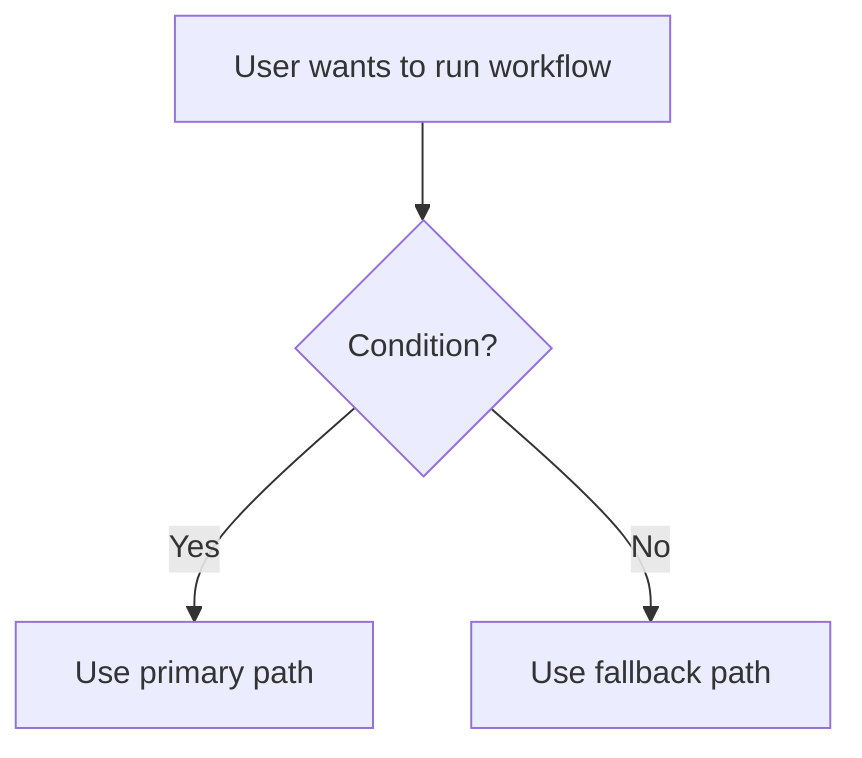
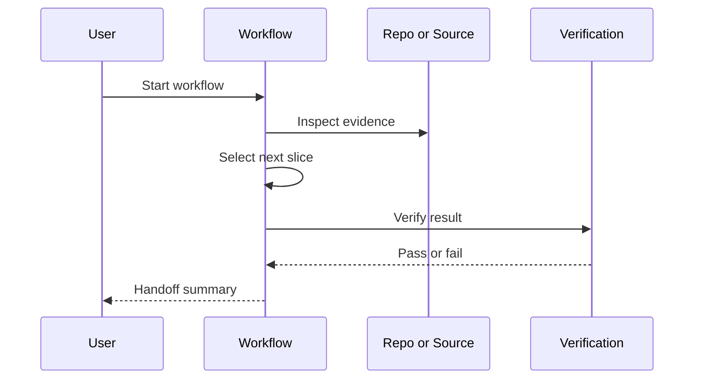
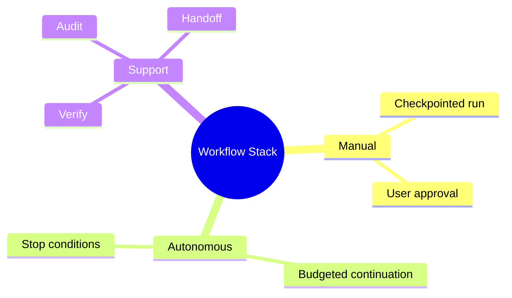

# Diagram Patterns

Use diagrams only when they reduce ambiguity.

## Decision Tree

Best for choosing a workflow, command, or snippet.

## Sequence Diagram

Best for showing actor/system order.

## Mind Map

Best for showing categories and relationships.

## Flow Diagram Checklist

Before adding a diagram, verify:

1. It answers a routing, order, ownership, or taxonomy question.
2. Labels are user-facing, not implementation-internal.
3. The diagram matches the prose steps exactly.
4. Mermaid syntax is copy-pasteable.
5. The same information is not already clearer as a table.

## Diagram Placement

- Put routing diagrams before detailed flows.
- Put sequence diagrams after the user understands the selected path.
- Put mind maps after inventory/reference sections.
- Avoid more than three diagrams in a single README unless the workflow is complex.
