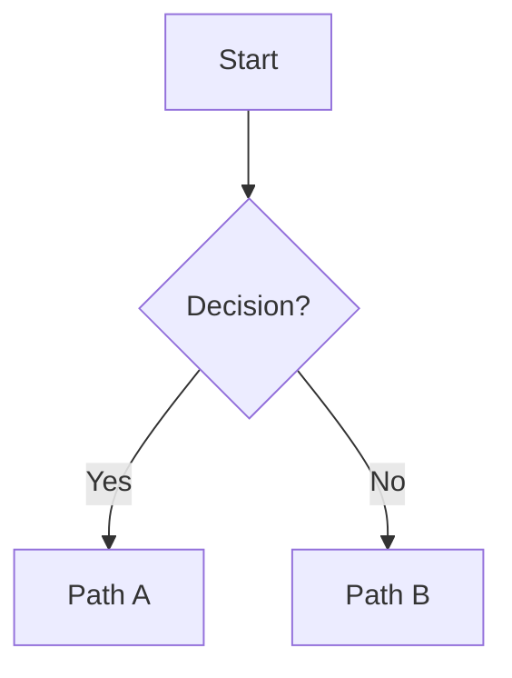

# <Workflow Name>

## Purpose

Explain what this workflow helps users do and what problem it solves.

## Start Here

1. If `<condition>`, use `<path>`.
2. If `<condition>`, use `<path>`.
3. After completion, run `<verification or closeout>`.

## Mode Comparison

| Mode | Use When | Primary Entry Point |
|---|---|---|
| `<mode>` | `<situation>` | `<command/snippet/doc>` |

## Decision Tree



## Canonical Flow

```text
<entry point>
→ <step>
→ <verification>
→ <handoff>
```

## Workflow Inventory

| Item | Purpose | When to Use |
|---|---|---|
| `<item>` | `<purpose>` | `<trigger>` |

## Detailed Steps

### 1. <Step Name>

- Inputs: `<inputs>`
- Action: `<action>`
- Output: `<output>`

### 2. <Step Name>

- Inputs: `<inputs>`
- Action: `<action>`
- Output: `<output>`

## Example Invocation

```text
<copy-paste example>
```

## Stop Conditions

Stop for:

1. `<blocking condition>`
2. `<blocking condition>`

Do not stop for:

1. `<non-blocking condition>`
2. `<non-blocking condition>`

## Verification

| Check | Command or Method | Pass Criteria |
|---|---|---|
| `<check>` | `<command>` | `<criteria>` |

## Handoff

Include:

- completed work
- evidence
- verification result
- risks or unknowns
- recommended next step

## Risks and Edge Cases

| Risk | Impact | Mitigation |
|---|---|---|
| `<risk>` | `<impact>` | `<mitigation>` |
