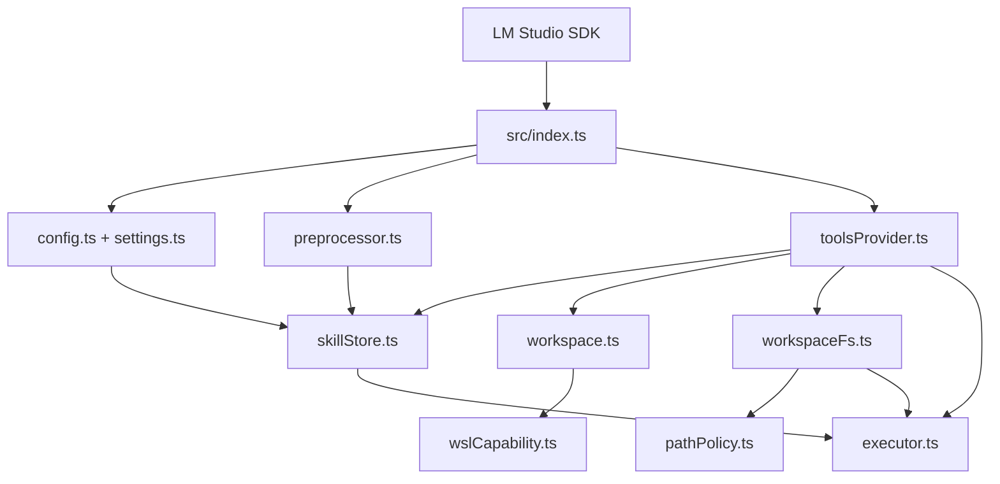

<!-- generated-by: gsd-doc-writer -->
# Architecture

## System Overview

The LMS Skills Plugin is a single-package TypeScript/CommonJS LM Studio plugin. LM Studio supplies plugin configuration, a provider working-directory identity, tool registration, and prompt preprocessing. The plugin converts that context into an environment-aware skill store, a deterministic contained project workspace, and a public tool surface that behaves consistently on Host or WSL.

## Component Diagram



## Data Flow

1. `main` in `src/index.ts` registers configuration, the tools provider, and the prompt preprocessor with LM Studio.
2. `resolveEffectiveConfig` combines LM Studio settings with persisted settings and normalizes Host/WSL behavior.
3. The prompt preprocessor creates an environment-aware skill store, discovers skills, expands explicit `/skill-name` activations, or injects an available-skills block.
4. The tools provider lazily resolves one deterministic workspace from the LM Studio provider working directory, selected environment, and WSL distribution.
5. Skill tools use `SkillStore`; project file tools use `WorkspaceFileSystem`; command tools use `executor.ts`.
6. Host operations use Node filesystem/process APIs. WSL operations invoke `wsl.exe` with explicit distribution, Linux-native cwd, and structured arguments.

## Key Abstractions

| Abstraction | Location | Responsibility |
|---|---|---|
| `EffectiveConfig` | `src/types.ts` | Normalized settings used by runtime components |
| `SkillStore` | `src/skillStore.ts` | Environment-aware skill discovery, search, reads, and listing |
| `WorkspaceContext` | `src/types.ts` | Deterministic workspace identity, environment, distribution, and root |
| `WorkspaceFileSystem` | `src/workspaceFs.ts` | Contained project filesystem operations for Host and WSL |
| `resolveWorkspaceContext` | `src/workspace.ts` | Creates Host or Linux-native WSL workspace roots |
| `resolveEnvironmentPath` | `src/pathPolicy.ts` | Classifies and resolves paths by target environment |
| `execCommand` / `execProgram` | `src/executor.ts` | Shell commands and direct program execution with limits |
| `toolsProvider` | `src/toolsProvider.ts` | Registers all public LM Studio tools and active command cwd |
| `promptPreprocessor` | `src/preprocessor.ts` | Injects skill availability and explicit skill content |
| `detectWslCapability` | `src/wslCapability.ts` | Detects WSL and validates distribution selection |

## Environment Invariant

The selected execution environment applies to every environment-sensitive operation:

- Host mode uses Host skill roots, Host workspaces, Host filesystem APIs, and the configured Host shell.
- WSL mode resolves skill roots from the selected distribution's `$HOME`, creates Linux-native workspaces, uses Linux tools for file operations, and runs commands through `/bin/bash`.
- No tool silently falls back between environments.

## Containment Model

Project paths are first resolved lexically and then canonicalized. Both checks must remain inside the workspace root. Host canonicalization uses `realpath`; WSL canonicalization uses Linux `realpath -m`. The workspace root cannot be deleted, and moves do not overwrite an existing destination unless overwrite is explicitly allowed internally.

Skill roots are a separate trust boundary. Skill tools resolve only within configured skill directories, while project file tools resolve only inside the active workspace.

## Directory Structure

```text
src/                  Runtime source modules
  index.ts            Plugin entry point
  config.ts           LM Studio settings schema
  settings.ts         Persistence and effective configuration
  toolsProvider.ts    Public tool definitions
  preprocessor.ts     Prompt and explicit-skill injection
  skillStore.ts       Host/WSL skill backend
  workspace.ts        Workspace identity and lifecycle
  workspaceFs.ts      Host/WSL project filesystem backend
  executor.ts         Host/WSL process execution
  pathPolicy.ts       Path classification and containment
  wslCapability.ts    WSL detection and distribution validation
test/                 Node test-runner suites
scripts/              Cross-platform test and release scripts
docs/                 User and contributor documentation
samples/              Example skills
.planning/             GSD project history and milestone records
```
